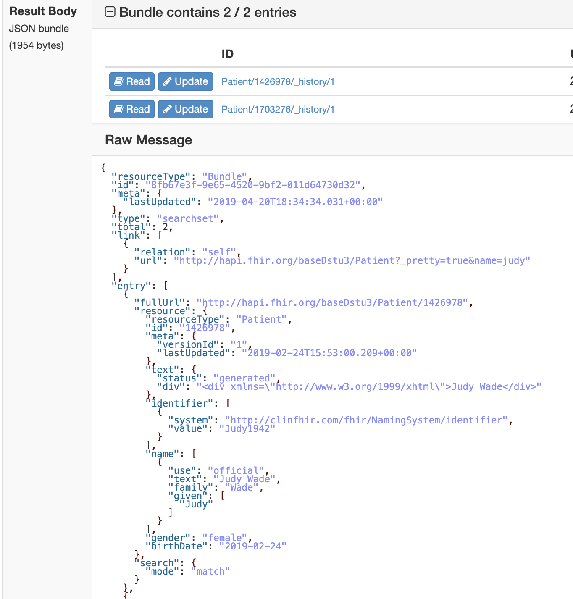

#Special Instructions

#### ##Team Name: HappyPin

##Project Name: Patient Medical History App

##Github link: <https://github.gatech.edu/gt-cs6440-hit-spring2019/Patient-Medical-History-App>

##Team Members:

* Xi Chen

* Yanzhe Cheng

* Chongwen Guo

* Zheng Fu

  

##Instructions: Luanch Patient Medical History App on HDAP via VPN

1. Setting up Cisco VPN client with you Gatech account username and password, then connect to anyc.vpn.gatech.edu.
2. Open a new window in web broswer and we suggest using Google Chrome.
3. Typing the follwong url in address bar and press Enter/Return button on the keyboard. It may take about 10 seconds to load everything.

```
https://cs6440-s19-prj032.apps.hdap.gatech.edu
```

## Instructions: Run Patient Medical History App Locally

1. If the client wishes to run the app on his/her local machine, it is required to install docker and docker-compose first.
2. To install docker on your local machine, please refer the following tutorial.

```
https://docs.docker.com/install/
```

3. To install docker-compose on your local machine, please refer the following tutorial.

```
https://docs.docker.com/compose/install/
```

4. Once the docker and docker-compose were successfully installed, download the codes from github and run docker-compose to build and start. 

```
# For windows user you may use CMD to open the command line window

cd ./Patient-Medical-History-App
docker-compose up --build
```

5. After the app was built and launched, typing the following address on the web browser and press Enter/Return button on the keyboard.

```
http://localhost:8087/
```

**Enter Patient Data**

Once the app was started on either HDAP or local machine, the end user could go to the "Enter Patient Data" page to create a new patient / update patient information. There three major function sections on this page.

1. Retrieving the previously introduced patient information:

If the patient is a returning patient, the end user could using the searching bar at the top-left corner to retrieve the previously introduced information by searching patient's social security number.

2. Input the patient basic information.

The eletronic forms on the top half of "Enter patient data" web page are quite similar with the one we often see on healthcare provider's office. And the end user could use it to dircectly input basic patient information. Note that if the end user employs Mac OS Safari web browser, the date format should be "YYYY-MM-DD", otherwise the app may report warnings and requires the end user to re-input the date data.

3. Input the patient health history.

The bottom half of "Enter patient data" web page was proposed to collect the patient health history. There are many radio buttons on there to help the end user determine if the patient had a certern disease/surgery/allergy etc. on the past.

After the end user filled every required fields on this page, she/he could click the "Submit" button at the lower right corner to upload the patient information to FHIR server as well as local MySQL database. If there are errors in the forms, the end user could click the "Reset" button at the lower left corner to refill the forms.

**View Patient Data**

The other import function of the app is to display the existed patient data along with protecting patient's privacy. Click the "View Patient Data" tab at the top of the webpage. Then the app will ask the end user to enter the key to proceed and the key is:

```
mysecretkey
```

And such key could be modified from the following file:

```
/patient-medical-history/src/main/resources/application.properties
```

and line 11:

```
secretkey=mysecretkey
```

Once the secretkey was verified, the end user could find and view the existed patient data by searching his/her SSN, First Name, Last Name and Date of Birth.


##Interaction with Fhir

### Add

* Patient name (first name, last name)
* SSN of patient
* Sex
* Date of birth
* Address (street, city, state, zip)
* Phone (home, work, cell)
* Marital status

### Update

- Patient name (first name, last name)

- SSN of patient

- Sex

- Date of birth

- Address (street, city, state, zip)

- Phone (home, work, cell)

- Marital status

  

## Test with Fair

We use following website to test the addition and updation: https://fhirtest.uhn.ca/resource?serverId=home_21&pretty=true&resource=Patient

Steps:

1. Under Search Parameters, choose search creterial and enter a search value. eg. name

   

2. In the Result Body, search for the target patient and check if the value being added or updated

   